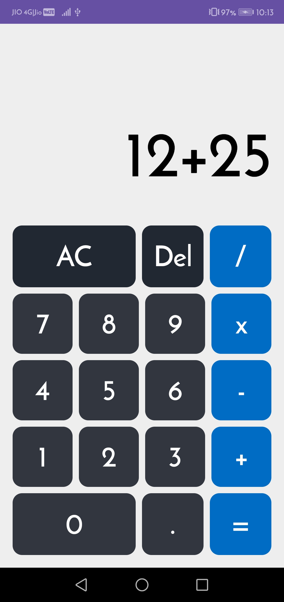

# Calculator App

## Overview

This is a simple calculator application built using Jetpack Compose for the Android platform. The app follows the MVVM (Model-View-ViewModel) architecture, providing a clean separation of concerns and a responsive user interface.

## Features

- Basic arithmetic operations: addition, subtraction, multiplication, and division.
- Clear and delete functionalities.
- Support for decimal numbers.
- Responsive design with a modern UI.

## Technologies Used

- **Kotlin**: The primary programming language for Android development.
- **Jetpack Compose**: A modern toolkit for building native UI in Android.
- **AndroidX**: A set of libraries to help with Android development.
- **MVVM Architecture**: A design pattern that separates the user interface from the business logic.


## Getting Started

### Prerequisites

- Android Studio installed on your machine.
- Basic knowledge of Kotlin and Android development.

### Installation

1. Clone the repository:
   ```
   git clone https://github.com/yourusername/calculatorapp.git
   ```

2. Open the project in Android Studio.

3. Build the project to download the necessary dependencies.

4. Run the app on an emulator or a physical device.

## Usage

- Launch the app to see the calculator interface.
- Tap the number buttons to input numbers.
- Use the operation buttons to perform calculations.
- Tap "AC" to clear the input or "Del" to delete the last entry.
- The result will be displayed at the top of the screen.

### Screenshot of the Calculator App UI

Here is a screenshot of the UI of the Calculator App:


